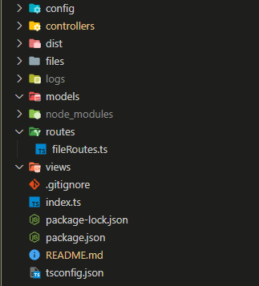

# Project Folders
###### Temos 8 pastas e cada uma tem o seu objetivo

1. config - Esta pasta serve para guardar as configurações/modulos
2. controllers - Esta pasta serve para guardar os controllers
3. dist - Esta pasta serve para guardar os arquivos compilados
4. files - Esta pasta serve para guardar os arquivos que o usuario vai enviar
5. logs - Esta pasta serve para guardar os logs
6. models - Esta pasta serve para guardar os models
7. routes - Esta pasta serve para guardar as rotas
8. views - Esta pasta serve para guardar as views

# Config Folder
## .env
Este ficheiro tem tambem o nome de enviroment varables. As varaiveis que aqui são definidas 
são as que vão ser usadas no projeto. Por exemplo, se eu quiser definir uma variavel que vai
guardar o nome da minha base de dados, eu vou definir assim:
```bash
DB_NAME=nome_da_base_de_dados
```
Ou para o nosso caso, definimos a porta que vai ser usada quando o sevidor inicia
```bash
PORT=3000
```
## dbPardal.json
Isto foi o que o professor pediu para fazer, é um ficheiro Json que vai conter todas as configurações standard que queremos 
```JSON
{
    "home":"./",
    "dbDir":"files",
    "routesDir":"routes",
    "modelsDir":"models",
    "viewsDir":"views",
    "controllersDir":"controllers",
    "dbgLevel":"error"
}
```
* home - diretorio do projeto
* dbDir - nome do diretorio onde vão ser guardados os ficheiros
* routesDir - nome do diretorio onde vão ser guardadas as rotas
* modelsDir - nome do diretorio onde vão ser guardados os models
* viewsDir - nome do diretorio onde vão ser guardadas as views
* controllersDir - nome do diretorio onde vão ser guardados os controllers
* dbgLevel - nivel de debug ?Ainda não percebi isto?

Este objeto json vai ser usado para criar as pastas que faltam e deixar o projeto standardizado

## logger.ts
Este ficheiro serve para fazer o log de tudo o que acontece no projeto. Por exemplo, se eu quiser fazer um log de um erro, eu vou fazer assim:
```typescript
import { createLogger, format, transports } from 'winston';
import winstonDailyRotateFile from 'winston-daily-rotate-file';

const logger = createLogger({
  level: 'info',
  format: format.combine(
    format.timestamp(),
    format.printf(info => `${info.timestamp} ${info.level}: ${info.message}`)
  ),
  transports: [
    new transports.Console(),
    new transports.File({ filename: 'logs/combined.log' }),
    new winstonDailyRotateFile({
      filename: 'logs/application-%DATE%.log',
      datePattern: 'YYYY-MM-DD',
      zippedArchive: true,
      maxSize: '20m',
      maxFiles: '14d'
    })
  ]
});

export { logger };

```

## module.ts
Este ficheiro serve para criar tudo o que estava no json anterior
```typescript
import fs from "fs";
import path from "path";
import conf from "../config/dbPardal.json";
let dbKernel: DbKernel;

let home;
let dbDir;

interface DbKernel {
  init: () => void;
  create: (params: any) => void;
}

dbKernel = {
  init: function () {

    home = conf.home;

    //Cria a pasta dos ficheiros
    dbDir = path.join(home, conf.dbDir);
    if (!fs.existsSync(dbDir)) {
      fs.mkdirSync(dbDir);
      console.log(`Directory ${dbDir} created successfully.`);
    }

    //Cria a pasta das Routes
    let routesDir = path.join(home, conf.routesDir);
    if (!fs.existsSync(routesDir)) {
      fs.mkdirSync(routesDir);
      console.log(`Directory ${routesDir} created successfully.`);
    }


    //Cria 3 pastas, Model, View e Controller
    let modelsDir = path.join(home, conf.modelsDir);
    if (!fs.existsSync(modelsDir)) {
      fs.mkdirSync(modelsDir);
      console.log(`Directory ${modelsDir} created successfully.`);
    }
    let controllersDir = path.join(home, conf.controllersDir);
    if (!fs.existsSync(controllersDir)) {
      fs.mkdirSync(controllersDir);
      console.log(`Directory ${controllersDir} created successfully.`);
    }
    let viewsDir = path.join(home, conf.viewsDir);
    if (!fs.existsSync(viewsDir)) {
      fs.mkdirSync(viewsDir);
      console.log(`Directory ${viewsDir} created successfully.`);
    }

  },
  create: function (params: any) {
    
  },
};

export default dbKernel;

```
# Controllers Folder
## fileController.ts
São apenas todas as ações CRUD (CREATE, READ, UPDATE, DELETE) que vão ser feitas, juntamente tem o logger a funcionar em caso de erro, estas funções vão ser chamadas pelo ficheiro fileRoutes.ts
```typescript
import {logger} from '../config/logger'
import {join} from 'path'
import fs from 'fs'
import {promisify} from 'util'
import conf from '../config/dbPardal.json'


const folderPath = join(conf.home,conf.dbDir);
const readFileAsync = promisify(fs.readFile);
const writeFileAsync = promisify(fs.writeFile);
const appendFileAsync = promisify(fs.appendFile);
const deleteFileAsync = promisify(fs.unlink);

const getPage = (req:any,res:any) => {
    res.send('GET request to the homepage')
}

const readFile = async (req:any,res:any)  => {
    const fileName = req.params.fileKey;
    const filePath = join(folderPath, fileName);
    try {
      const data:string = await readFileAsync(filePath, "utf-8");
      handleSuccess(1,filePath,data)
      const jsonData = JSON.parse(data);
      res.send(jsonData);
    } catch (err) {
      console.log(err);
      handleErrors(1,err,filePath)
      res.status(500).send("Error reading file");
    }
}

const writeFile = async (req:any,res:any) => {
    const fileName = req.params.fileKey;
    const filePath = join(folderPath, fileName);
    const data: string = JSON.stringify(req.body);
    try {
      await appendFileAsync(filePath, data, "utf-8");
      handleSuccess(2,filePath,data)
      res.send("File saved successfully");
    } catch (err) {
      console.log(err);
      handleErrors(2,err,filePath)
      res.status(500).send("Error writing file");
    }
}

const updateFile = async (req:any,res:any) => {
    const fileName = req.params.fileKey;
    const filePath = join(folderPath, fileName);
    const data: string = JSON.stringify(req.body);
    try {
      await writeFileAsync(filePath, JSON.stringify(data) , "utf-8");
      handleSuccess(3,filePath,data)
      res.send("File updated successfully");
    } catch (err) {
      console.log(err);
      handleErrors(3,err,filePath)
      res.status(500).send("Error updating file");
    }
}

const deleteFile = async (req:any,res:any) => {
    const fileName = req.params.fileKey;
    const filePath = join(folderPath, fileName);
    try {
      await deleteFileAsync(filePath);
      handleSuccess(4,filePath)
      res.send("File deleted successfully");
    } catch (err) {
      console.log(err);
      handleErrors(4,err,filePath)
      res.status(500).send("Error deleting file");
    }
}

const handleErrors = async (errorLevel:number,err:unknown,filePath:string) =>{
    switch(errorLevel){
        case 1:
            logger.error('Error reading file '+ err + ' from ' + filePath);
            break;
        case 2:
            logger.error('Error writing file '+ err + ' from ' + filePath);
            break;
        case 3:
            logger.error('Error updating file '+ err + ' from ' + filePath);
            break;
        case 4:
            logger.error('Error deleting file '+ err + ' from ' + filePath);
            break;
        default:
            logger.error('Error '+ err + ' from ' + filePath);
            break;
    }
}
const handleSuccess = async (successLevel:number,filePath:string,data?:string) =>{
    switch(successLevel){
        case 1:
            logger.info('File read successfully with data: \n' + data + '\n from ' + filePath);
            break;
        case 2:
            logger.info('File saved successfully with data: \n' + data + '\n from ' + filePath);
            break;
        case 3:
            logger.info('File updated successfully with data: \n' + data + '\n from ' + filePath);
            break;
        case 4:
            logger.info('File deleted successfully from ' + filePath);
            break;
        default:
            logger.info('Success from ' + filePath);
            break;
    }
}

export default {getPage,readFile,writeFile,updateFile,deleteFile}
```
A parte mais confusa pode ser onde tem o promisify, ignorem isso, é apenas para tornar mais simples e facil de usar o async/await com as operações do filesystem que já deveriam de saber
# Dist Folder
## Não mexer

### SIMPLESMENTE NÃO MEXEM AQUI
Esta pasta é o typescript compilado

# files Folder
## Objetivo
É, segundo o professor, a nossa "base de dados distribuida", vai guardar os ficheiros que são criados através das funções do ficheiro <b>fileController.ts</b>
# Logs Folder

## Não preciso de dizer nada
...
# Models Folder
## Para que serve
Neste momento não serve para nada, mas pode vir a servir. 
Aqui apenas ficam os dados nada de mais
# Routes Folder
## Para que serve
Serve apenas para definir as rotas que vão ser feitas, quando uma delas é chamada vão usar a sua respetiva função do <b>fileController.ts</b>
## fleRoutes.ts
É o ficheiro das rotas
```typescript

import express from 'express';
import fileController from '../controllers/fileController'

const router = express.Router();


router.get('/',fileController.getPage)
router.get("/read/:fileKey",fileController.readFile)
router.post("/write/:fileKey",fileController.writeFile);
router.post('/update/:fileKey',fileController.updateFile);
router.post('/delete/:fileKey',fileController.deleteFile);

export default router;


```
O router é uma componente do express, que permite depois ser importado noutro ficheiro

# Views Folder
## Para que serve
Serve para guardar as páginas html que vão ser usadas para testar as rotas por enquanto nenhuma

# package.json file
## Para que serve
Serve para guardar as dependências do projeto, e para definir os scripts que vão ser usados para correr o projeto
## scripts
### start
Serve para correr o projeto
### dev
Serve para correr o projeto em modo de desenvolvimento, ou seja, com o nodemon
### build
Serve para compilar o projeto de typescript para javascript. Este comando tem de ser sempre chamado depois de se fazer alguma alteração (supondo que não estão a usar o comando mais à frente)
### nodeMon
Mete o servidor a dar com hot reload, basicamente faz alterações em tempo real e o servidor reinicia sem ter de usar comandos esquisitos
### test
Ignorem
# tsconfig.json file
## Não mexer
### SIMPLESMENTE NÃO MEXEM AQUI

# index.ts

Adivinhem o que é que faz...
```typescript
import express, { Express } from 'express';
import dotenv from 'dotenv';
import module from './config/module'
import bodyParser from "body-parser";
import {logger} from './config/logger';
import fileRoutes from './routes/fileRoutes'


module.init()
dotenv.config();

const app: Express = express();
app.use(bodyParser.json())
const port = process.env.PORT;


//Routes for files manipulation
app.use('/file',fileRoutes)

app.listen(port, () => {
  logger.info("-------------------------------------------Server started---------------------------------------------");
  console.log(`⚡️[server]: Server is running at http://localhost:${port}`);
});

```
Apenas um pequeno detalhe, o router do ficheiro fileRoutes.ts é usado aqui ```typescript app.use('/file',fileRoutes) ```
todas as rotas que forem a usar as funções das files terão um link deste género:
```typescript
http://localhost:3000/file/read/filename
```

